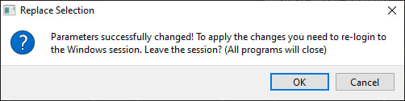
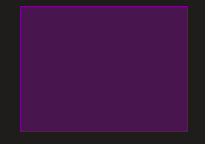
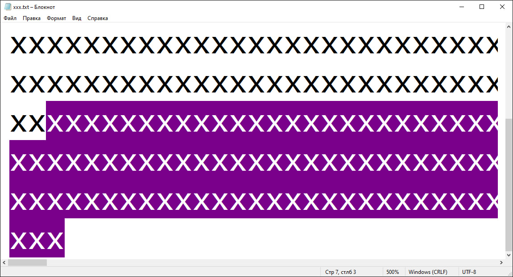

# Replace-selection
Change selection color windows 10/11

<h2> 📛 Information</h2>

<h4> enter colors in rgb format, and press refresh if you want to see how it will look, and press apply</h2>

<h4>next you will show the following:</h4>

<h4>Next, you’ll kick Windows out of the session, and you’re done!</h4>

   
